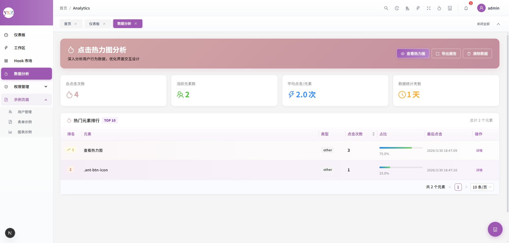

<<<<<<< HEAD
<div align="center">

# Next Admin Starter

基于 Next.js 15 + Ant Design 的现代化管理后台模板，提供完整的布局系统、主题系统、核心组件和示例页面。

[](https://nextjs.org/)
[](https://react.dev/)
[](https://ant.design/)
[](https://www.typescriptlang.org/)
[](https://tailwindcss.com/)
[](LICENSE)

</div>

## 快速开始

[在线演示](#) · [功能预览](#-特性) · [文档](docs/) · [更新日志](CHANGELOG.md)

## ✨ 特性

- 🚀 **Next.js 15** - 使用最新的 React Server Components 和 App Router
- 🎨 **Ant Design 6** - 企业级 UI 组件库
- 🌈 **主题系统** - 支持多种主题色切换（蓝猫、紫薯、橙子）
- 🎯 **布局系统** - 侧边栏菜单 + 路由标签页 + 页面过渡
- 🔒 **权限守卫** - 基于路由的权限控制
- 📦 **核心组件** - ProTable、SearchForm、ModalForm、DrawerForm
- 📱 **响应式设计** - 支持移动端和桌面端
- 🛠️ **TypeScript** - 完整的类型定义
- 🎨 **Tailwind CSS 4** - 原子化 CSS 框架
- 🔌 **前后端分离** - 完全解耦的前后端架构，支持对接任意后端（Go、PHP、Java、Python 等）

## 📸 预览

### 主界面


### 用户管理


### 数据分析



## 🚀 快速开始

### 环境要求

- Node.js >= 18.0.0
- npm >= 9.0.0 或 yarn >= 1.22.0 或 pnpm >= 8.0.0

### 安装依赖

```bash
# 克隆项目
git clone https://github.com/yourusername/next-admin-starter.git
cd next-admin-starter

# 安装依赖
npm install
# 或
yarn install
# 或
pnpm install
```

### 启动开发服务器

```bash
# 开发模式（使用 Turbopack，端口 7001）
npm run dev
# 或
yarn dev
# 或
pnpm dev
```

开发服务器将在 [http://localhost:7001](http://localhost:7001) 启动。

### 生成项目截图

```bash
# 安装截图依赖（首次使用）
npm run screenshot:setup

# 启动项目
npm run dev

# 在新终端运行截图脚本
npm run screenshot
```

脚本会自动登录并截取所有关键页面，保存到 `screenshots/` 目录。

详细说明请查看 [快速截图指南](screenshots/QUICKSTART.md)。

### 构建生产版本

```bash
# 构建
npm run build

# 启动生产服务器
npm start
```

## 🔐 默认账号

- 用户名: dmin
- 密码: dmin123

## 📁 项目结构

```
next-admin-starter/
├── src/
│   ├── app/                      # Next.js App Router
│   │   ├── dashboard/            # 仪表板页面
│   │   ├── analytics/            # 数据分析页面
│   │   ├── examples/             # 示例页面
│   │   │   ├── charts/           # 图表示例
│   │   │   ├── forms/            # 表单示例
│   │   │   └── users/            # 用户管理示例
│   │   ├── hook-market/          # Hook 市场页面
│   │   ├── login/                # 登录页面
│   │   ├── workspace/            # 工作区页面
│   │   ├── layout.tsx            # 根布局
│   │   ├── page.tsx              # 首页
│   │   └── globals.css           # 全局样式
│   ├── api/                      # API 接口定义
│   │   └── user.ts               # 用户相关 API
│   ├── components/               # React 组件
│   │   ├── auth/                 # 权限相关组件
│   │   │   └── AuthGuard.tsx     # 权限守卫
│   │   ├── core/                 # 核心业务组件
│   │   │   ├── StatCard.tsx      # 统计卡片
│   │   │   ├── Chart/            # 图表组件
│   │   │   ├── DrawerForm/       # 抽屉表单
│   │   │   ├── FileUpload/       # 文件上传
│   │   │   ├── ImagePreview/     # 图片预览
│   │   │   ├── InfoModal/        # 信息模态框
│   │   │   ├── ModalForm/        # 模态框表单
│   │   │   ├── PageContainer/    # 页面容器
│   │   │   ├── ProTable/         # 增强表格
│   │   │   └── SearchForm/       # 搜索表单
│   │   ├── features/             # 功能特性组件
│   │   │   ├── AIAssistant/      # AI 助手
│   │   │   ├── AICommandPanel/   # AI 命令面板
│   │   │   ├── CommandPalette/   # 命令面板
│   │   │   ├── HeatmapOverlay/   # 热力图覆盖层
│   │   │   ├── HistoryPanel/     # 历史面板
│   │   │   ├── PerformanceMonitor/ # 性能监控
│   │   │   ├── ShortcutList/     # 快捷键列表
│   │   │   └── ThemeEditor/      # 主题编辑器
│   │   ├── layouts/              # 布局组件
│   │   │   ├── HeaderBar.tsx     # 顶部导航栏
│   │   │   ├── LayoutController.tsx # 布局控制器
│   │   │   ├── menuConfig.tsx    # 菜单配置
│   │   │   ├── PageProgressBar.tsx # 页面进度条
│   │   │   ├── PageTransition.tsx  # 页面过渡动画
│   │   │   ├── RouteTabs.tsx     # 路由标签页
│   │   │   ├── RouteTabsContext.tsx # 标签页上下文
│   │   │   ├── RouteTabsListener.tsx # 标签页监听器
│   │   │   └── SideMenu.tsx      # 侧边栏菜单
│   │   ├── providers/            # 提供者组件
│   │   │   ├── AntdProvider.tsx  # Ant Design 配置
│   │   │   └── CssLoader.tsx     # CSS 加载器
│   │   └── workspace/            # 工作区组件
│   │       └── widgets/
│   │           └── StatCardWidget.tsx
│   ├── hooks/                    # 自定义 Hooks
│   │   ├── useAICommand.ts       # AI 命令 Hook
│   │   ├── useHeatmap.ts         # 热力图 Hook
│   │   ├── useHistory.ts         # 历史记录 Hook
│   │   ├── useShortcut.ts        # 快捷键 Hook
│   │   ├── useWorkspace.ts       # 工作区 Hook
│   │   ├── market/               # Hook 市场
│   │   │   ├── registry.ts       # Hook 注册表
│   │   │   └── useHookMarket.ts  # Hook 市场 Hook
│   │   └── presets/              # 预设 Hooks
│   │       ├── useConfirm.ts     # 确认对话框 Hook
│   │       ├── useDataExport.ts  # 数据导出 Hook
│   │       ├── useFormSubmit.ts  # 表单提交 Hook
│   │       └── useTableData.ts   # 表格数据 Hook
│   ├── store/                    # Zustand 状态管理
│   ├── types/                    # TypeScript 类型定义
│   │   ├── ai-command.ts         # AI 命令类型
│   │   ├── heatmap.ts            # 热力图类型
│   │   ├── hook-market.ts        # Hook 市场类型
│   │   └── workspace.ts          # 工作区类型
│   └── utils/                    # 工具函数
│       └── request.ts            # HTTP 请求封装
├── docs/                         # 文档目录
│   ├── API_INTEGRATION.md        # 后端对接指南
│   └── DEPLOYMENT.md             # 部署指南
├── public/                       # 静态资源
├── screenshots/                  # 项目截图
│   └── README.md                 # 截图说明
├── .env.development              # 开发环境变量
├── .env.example                  # 环境变量模板
├── .env.local                    # 本地环境变量（不提交）
├── .gitignore                    # Git 忽略文件
├── AGENTS.md                     # 项目上下文指南
├── CHANGELOG.md                  # 更新日志
├── CONTRIBUTING.md               # 贡献指南
├── LICENSE                       # MIT 许可证
├── next-env.d.ts                 # Next.js 类型定义
├── next.config.mjs               # Next.js 配置
├── package.json                  # 项目配置和依赖
├── postcss.config.mjs            # PostCSS 配置
├── README.md                     # 项目文档
├── tailwind.config.ts            # Tailwind CSS 配置
└── tsconfig.json                 # TypeScript 配置
```

## 📚 文档

- [🔌 后端对接指南](docs/API_INTEGRATION.md) - 如何将项目与 Go、PHP、Java、Python 等后端对接
- [🚀 部署指南](docs/DEPLOYMENT.md) - Vercel、Netlify、Docker、Nginx 等多种部署方式
- [📸 截图快速上手](docs/SUPPLEMENTAL_INFO.md) - 一键生成项目截图
- [📖 项目上下文指南](AGENTS.md) - 详细的项目结构和开发指南
- [🤝 贡献指南](CONTRIBUTING.md) - 如何为项目做出贡献
- [📋 项目文件清单](PROJECT_CHECKLIST.md) - 所有项目文件及其用途
- [📝 更新日志](CHANGELOG.md) - 版本更新记录

## 🎨 核心组件

### ProTable

增强的表格组件，支持搜索、分页、批量操作等功能。

` sx
import ProTable from '@/components/core/ProTable'

<ProTable
columns={columns}
dataSource={data}
loading={loading}
rowKey="id"
searchForm={<SearchForm {...searchFormProps} />}
headerActions={<Button>新增</Button>}
onRefresh={handleRefresh}
pagination={{ current, pageSize, total }}
/>
`

### SearchForm

搜索表单组件，支持多种表单字段类型。

` sx
import SearchForm from '@/components/core/SearchForm'

<SearchForm
form={form}
onSearch={handleSearch}
onReset={handleReset}
loading={loading}

> <Form.Item name="name" label="姓名">

    <Input placeholder="请输入姓名" />

</Form.Item>
</SearchForm>
`

### ModalForm

模态框表单组件，支持表单验证和提交。

` sx
import ModalForm from '@/components/core/ModalForm'

<ModalForm
ref={modalFormRef}
form={form}
title="用户信息"
onOk={handleOk}
width={600}

> <Form.Item name="name" label="姓名" rules={[{ required: true }]}>

    <Input placeholder="请输入姓名" />

</Form.Item>
</ModalForm>
`

### DrawerForm

抽屉表单组件，类似于 ModalForm，但使用抽屉形式。

` sx
import DrawerForm from '@/components/core/DrawerForm'

<DrawerForm
ref={drawerFormRef}
form={form}
title="用户信息"
onOk={handleOk}
width={600}

> <Form.Item name="name" label="姓名" rules={[{ required: true }]}>

    <Input placeholder="请输入姓名" />

</Form.Item>
</DrawerForm>
`

## 🔐 权限守卫

使用 AuthGuard 组件保护需要登录的页面：

` sx
import AuthGuard from '@/components/auth/AuthGuard'

export default function ProtectedPage() {
return (
<AuthGuard>
<div>需要登录才能访问的内容</div>
</AuthGuard>
)
}
`

## 🎨 主题切换

项目支持三种主题色，可以通过右下角的浮动按钮切换：

- **蓝猫** - 蓝色主题
- **紫薯** - 紫色主题
- **橙子** - 橙色主题

主题配置在 src/components/providers/AntdProvider.tsx 中。

## 📝 开发规范

### 组件命名

- 使用 PascalCase 命名组件文件
- 组件导出使用 export default
- 类型定义使用 interface 或 ype

### 样式规范

- 优先使用内联样式
- 使用 CSS 变量 ar(--theme-primary) 引用主题色
- 遵循 Ant Design 的设计规范

### 路径别名

项目已配置 @/ 别名，指向 src/ 目录：

`	sx
import Component from '@/components/Component'
import utils from '@/utils/utils'
`

## 🤝 贡献

欢迎提交 Issue 和 Pull Request！

### 贡献指南

1. Fork 本仓库
2. 创建你的特性分支 (`git checkout -b feature/AmazingFeature`)
3. 提交你的更改 (`git commit -m 'Add some AmazingFeature'`)
4. 推送到分支 (`git push origin feature/AmazingFeature`)
5. 开启一个 Pull Request

### 代码规范

- 使用 TypeScript 编写代码
- 遵循 ESLint 规则
- 使用 Prettier 格式化代码
- 编写有意义的提交信息

## ❓ 常见问题

### 如何修改主题色？

主题配置在 `src/components/providers/AntdProvider.tsx` 中的 `THEMES` 对象中。你可以修改颜色值或添加新的主题。

### 如何添加新的菜单项？

编辑 `src/components/layouts/menuConfig.tsx` 文件，在 `menuItems` 数组中添加新的菜单项。

### 如何禁用权限守卫？

移除页面中的 `AuthGuard` 组件包裹，或者在 `src/components/auth/AuthGuard.tsx` 中修改逻辑。

### 如何修改端口？

在 `package.json` 的 scripts 中修改 `--port 7001` 为你想要的端口号。

## 🗺️ 路线图

- [ ] 添加更多图表组件
- [ ] 完善权限管理系统
- [ ] 添加国际化支持
- [ ] 提供更多预设主题
- [ ] 优化性能和加载速度
- [ ] 添加单元测试和 E2E 测试

## 📄 许可证

本项目采用 [MIT](LICENSE) 许可证。

## 🙏 致谢

感谢以下开源项目：

- [Next.js](https://nextjs.org/) - React 框架
- [Ant Design](https://ant.design/) - 企业级 UI 设计语言
- [Tailwind CSS](https://tailwindcss.com/) - 原子化 CSS 框架
- [TypeScript](https://www.typescriptlang.org/) - JavaScript 的超集
- [Zustand](https://docs.pmnd.rs/zustand) - 轻量级状态管理
- [Lucide React](https://lucide.dev/) - 图标库

## 📮 联系方式

- 项目主页: [https://github.com/yourusername/next-admin-starter](https://github.com/yourusername/next-admin-starter)
- 问题反馈: [Issues](https://github.com/yourusername/next-admin-starter/issues)
- 邮箱: your.email@example.com

---

如果这个项目对你有帮助，请给一个 ⭐️ Star 支持一下！
=======
# next-admin-starter
admin-manager
>>>>>>> 5a5df70cdabde8209d5d553f42bb15f65a4015c7
